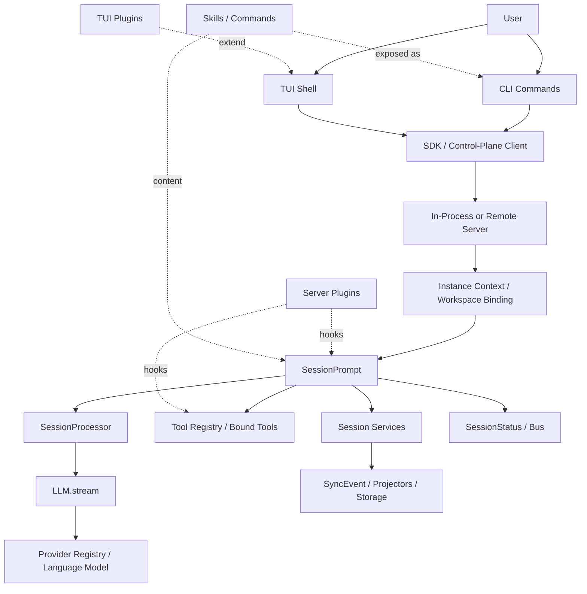
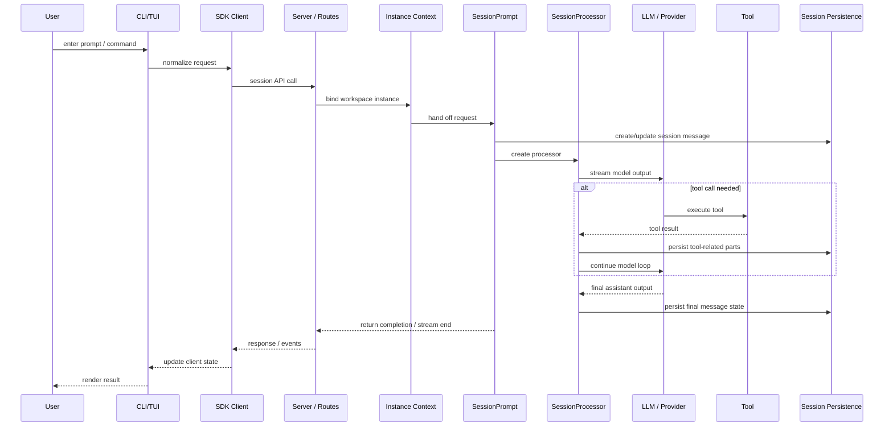
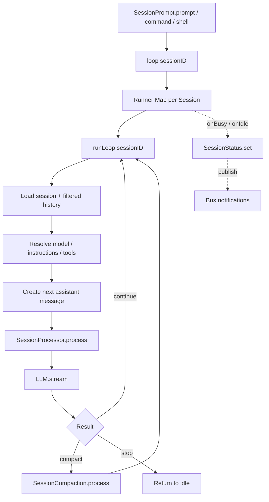
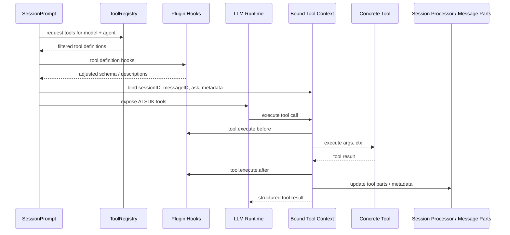
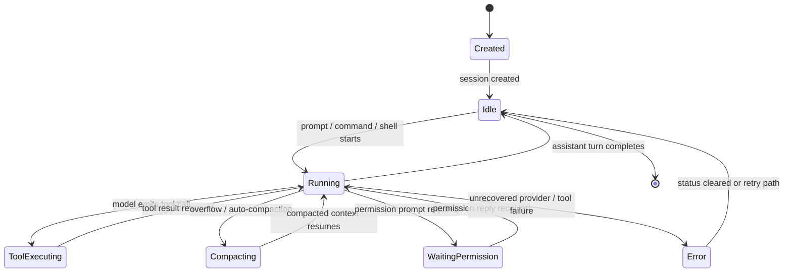
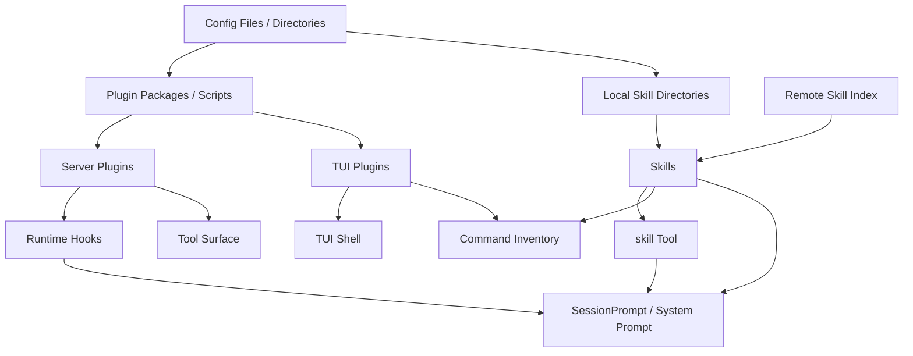
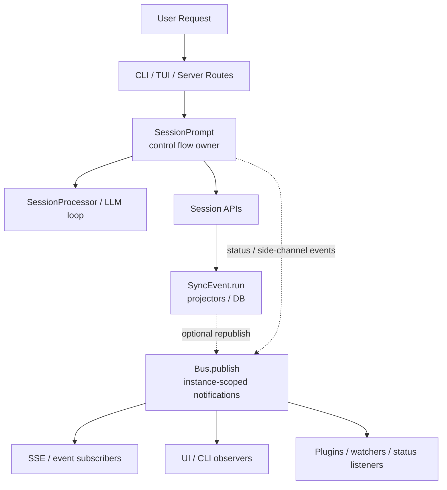

# System Diagrams

This page is the visual companion to the written architecture analysis. Read it when you want the main runtime relationships quickly, then use the architecture, module, and call-flow docs to drill into details.

Recommended reading order:

1. this page for the overall shape,
2. `architecture.md` for the structured narrative,
3. `modules/` for subsystem responsibilities,
4. `callflows/` for code-anchored execution traces.

## 1. System Overview



Primary code anchors:

- `workspace/source/opencode/packages/opencode/src/index.ts`
- `workspace/source/opencode/packages/opencode/src/server/server.ts`
- `workspace/source/opencode/packages/opencode/src/session/prompt.ts`
- `workspace/source/opencode/packages/opencode/src/session/processor.ts`
- `workspace/source/opencode/packages/opencode/src/provider/provider.ts`
- `workspace/source/opencode/packages/opencode/src/tool/registry.ts`

## 2. Startup And Entry Flow

```mermaid
flowchart TD
    Start[User runs opencode]
    Bin[bin/opencode wrapper]
    Dev[dev script -> src/index.ts]
    Index[src/index.ts]
    Yargs[yargs parser + middleware]
    Run[run / session commands]
    TuiCmd[TUI commands]
    Serve[serve command]
    Bootstrap[cli/bootstrap.ts]
    InstanceBootstrap[InstanceBootstrap]
    LocalSDK[Local SDK client]
    ServerFetch[Server.Default().fetch]
    Listen[Server.listen]
    Router[WorkspaceRouterMiddleware]

    Start --> Bin
    Start --> Dev
    Bin --> Index
    Dev --> Index
    Index --> Yargs
    Yargs --> Run
    Yargs --> TuiCmd
    Yargs --> Serve
    Run --> Bootstrap
    TuiCmd --> Bootstrap
    Bootstrap --> InstanceBootstrap
    Bootstrap --> LocalSDK
    LocalSDK --> ServerFetch
    Serve --> Listen
    Listen --> Router
    Router --> InstanceBootstrap
```

Primary code anchors:

- `workspace/source/opencode/packages/opencode/bin/opencode`
- `workspace/source/opencode/packages/opencode/src/index.ts`
- `workspace/source/opencode/packages/opencode/src/cli/bootstrap.ts`
- `workspace/source/opencode/packages/opencode/src/project/bootstrap.ts`
- `workspace/source/opencode/packages/opencode/src/cli/cmd/serve.ts`
- `workspace/source/opencode/packages/opencode/src/server/router.ts`

## 3. End-To-End User Request Sequence



Primary code anchors:

- `workspace/source/opencode/packages/opencode/src/cli/cmd/run.ts`
- `workspace/source/opencode/packages/opencode/src/server/routes/session.ts`
- `workspace/source/opencode/packages/opencode/src/session/prompt.ts`
- `workspace/source/opencode/packages/opencode/src/session/processor.ts`
- `workspace/source/opencode/packages/opencode/src/session/llm.ts`
- `workspace/source/opencode/packages/opencode/src/session/index.ts`

## 4. Runtime Orchestration Core



Primary code anchors:

- `workspace/source/opencode/packages/opencode/src/session/prompt.ts`
- `workspace/source/opencode/packages/opencode/src/effect/runner.ts`
- `workspace/source/opencode/packages/opencode/src/session/processor.ts`
- `workspace/source/opencode/packages/opencode/src/session/compaction.ts`
- `workspace/source/opencode/packages/opencode/src/session/status.ts`

## 5. Tool Execution Sequence



Primary code anchors:

- `workspace/source/opencode/packages/opencode/src/tool/tool.ts`
- `workspace/source/opencode/packages/opencode/src/tool/registry.ts`
- `workspace/source/opencode/packages/opencode/src/session/prompt.ts`
- `workspace/source/opencode/packages/opencode/src/session/llm.ts`
- `workspace/source/opencode/packages/opencode/src/session/processor.ts`

## 6. Session Lifecycle State Machine



Primary code anchors:

- `workspace/source/opencode/packages/opencode/src/session/index.ts`
- `workspace/source/opencode/packages/opencode/src/session/prompt.ts`
- `workspace/source/opencode/packages/opencode/src/session/status.ts`
- `workspace/source/opencode/packages/opencode/src/session/compaction.ts`
- `workspace/source/opencode/packages/opencode/src/session/processor.ts`

## 7. Extension Architecture



Primary code anchors:

- `workspace/source/opencode/packages/opencode/src/plugin/index.ts`
- `workspace/source/opencode/packages/opencode/src/plugin/loader.ts`
- `workspace/source/opencode/packages/opencode/src/cli/cmd/tui/plugin/runtime.ts`
- `workspace/source/opencode/packages/opencode/src/skill/index.ts`
- `workspace/source/opencode/packages/opencode/src/skill/discovery.ts`
- `workspace/source/opencode/packages/opencode/src/tool/skill.ts`

## 8. SessionPrompt vs SyncEvent vs Bus

This diagram is the shortest way to avoid a common misunderstanding: `Bus` is not the single control backbone of Opencode. `SessionPrompt` owns interactive orchestration, `SyncEvent` owns durable projection flow, and `Bus` exposes observable runtime notifications.



Primary code anchors:

- `workspace/source/opencode/packages/opencode/src/session/prompt.ts`
- `workspace/source/opencode/packages/opencode/src/session/index.ts`
- `workspace/source/opencode/packages/opencode/src/sync/index.ts`
- `workspace/source/opencode/packages/opencode/src/bus/index.ts`
- `workspace/source/opencode/packages/opencode/src/server/routes/event.ts`
- `workspace/source/opencode/packages/opencode/src/session/status.ts`

## Next Reading

- `architecture.md`
- `blog/opencode-deep-dive.md`
- `modules/`
- `callflows/`
