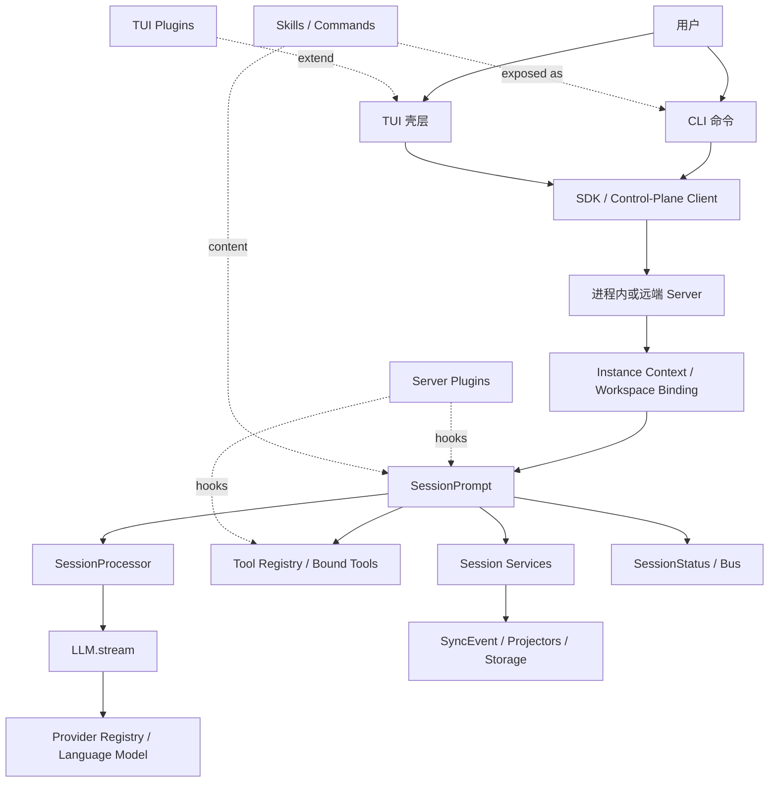
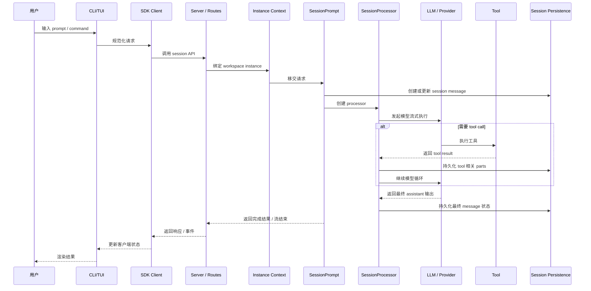
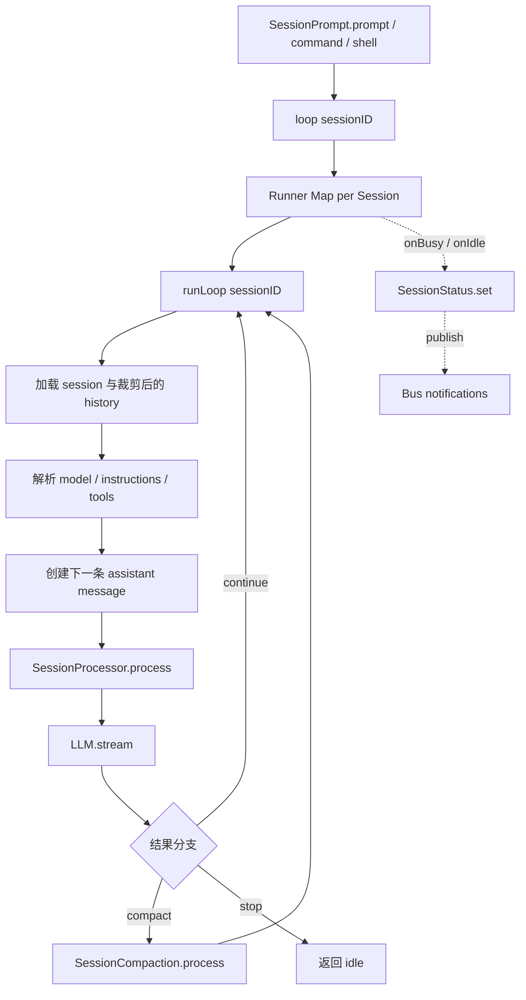
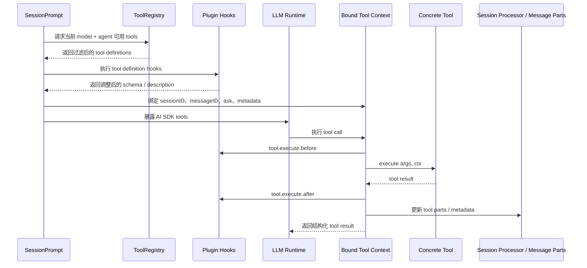
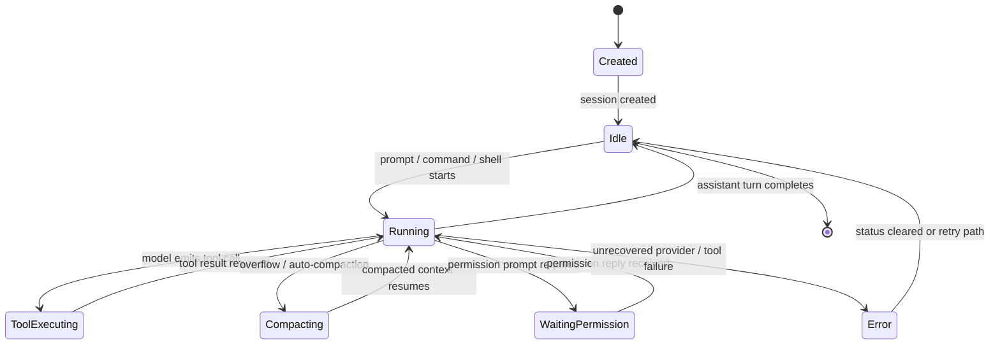
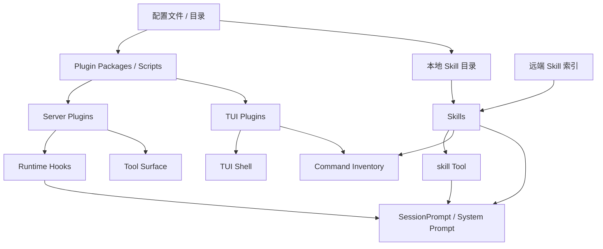

# 系统流程图集

这页是文字架构分析的可视化配套。你如果想先快速把 Opencode 的整体形状、控制边界和关键运行时链路看清楚，先读这里；如果想继续下钻，再回到 `architecture.md`、`modules/` 和 `callflows/`。

推荐阅读顺序：

1. 先看这页，把系统形状建立起来
2. 再看 `architecture.md`，理解结构化叙事
3. 再看 `modules/`，理解各子系统职责
4. 最后看 `callflows/`，核对具体调用链证据

## 1. 系统总览图



主要代码锚点：

- `workspace/source/opencode/packages/opencode/src/index.ts`
- `workspace/source/opencode/packages/opencode/src/server/server.ts`
- `workspace/source/opencode/packages/opencode/src/session/prompt.ts`
- `workspace/source/opencode/packages/opencode/src/session/processor.ts`
- `workspace/source/opencode/packages/opencode/src/provider/provider.ts`
- `workspace/source/opencode/packages/opencode/src/tool/registry.ts`

## 2. 启动与入口图

```mermaid
flowchart TD
    Start[用户运行 opencode]
    Bin[bin/opencode wrapper]
    Dev[dev 脚本 -> src/index.ts]
    Index[src/index.ts]
    Yargs[yargs parser + middleware]
    Run[run / session commands]
    TuiCmd[TUI commands]
    Serve[serve command]
    Bootstrap[cli/bootstrap.ts]
    InstanceBootstrap[InstanceBootstrap]
    LocalSDK[本地 SDK client]
    ServerFetch[Server.Default().fetch]
    Listen[Server.listen]
    Router[WorkspaceRouterMiddleware]

    Start --> Bin
    Start --> Dev
    Bin --> Index
    Dev --> Index
    Index --> Yargs
    Yargs --> Run
    Yargs --> TuiCmd
    Yargs --> Serve
    Run --> Bootstrap
    TuiCmd --> Bootstrap
    Bootstrap --> InstanceBootstrap
    Bootstrap --> LocalSDK
    LocalSDK --> ServerFetch
    Serve --> Listen
    Listen --> Router
    Router --> InstanceBootstrap
```

主要代码锚点：

- `workspace/source/opencode/packages/opencode/bin/opencode`
- `workspace/source/opencode/packages/opencode/src/index.ts`
- `workspace/source/opencode/packages/opencode/src/cli/bootstrap.ts`
- `workspace/source/opencode/packages/opencode/src/project/bootstrap.ts`
- `workspace/source/opencode/packages/opencode/src/cli/cmd/serve.ts`
- `workspace/source/opencode/packages/opencode/src/server/router.ts`

## 3. 用户请求端到端时序图



主要代码锚点：

- `workspace/source/opencode/packages/opencode/src/cli/cmd/run.ts`
- `workspace/source/opencode/packages/opencode/src/server/routes/session.ts`
- `workspace/source/opencode/packages/opencode/src/session/prompt.ts`
- `workspace/source/opencode/packages/opencode/src/session/processor.ts`
- `workspace/source/opencode/packages/opencode/src/session/llm.ts`
- `workspace/source/opencode/packages/opencode/src/session/index.ts`

## 4. Runtime 编排核心图



主要代码锚点：

- `workspace/source/opencode/packages/opencode/src/session/prompt.ts`
- `workspace/source/opencode/packages/opencode/src/effect/runner.ts`
- `workspace/source/opencode/packages/opencode/src/session/processor.ts`
- `workspace/source/opencode/packages/opencode/src/session/compaction.ts`
- `workspace/source/opencode/packages/opencode/src/session/status.ts`

## 5. Tool 执行时序图



主要代码锚点：

- `workspace/source/opencode/packages/opencode/src/tool/tool.ts`
- `workspace/source/opencode/packages/opencode/src/tool/registry.ts`
- `workspace/source/opencode/packages/opencode/src/session/prompt.ts`
- `workspace/source/opencode/packages/opencode/src/session/llm.ts`
- `workspace/source/opencode/packages/opencode/src/session/processor.ts`

## 6. Session 生命周期状态图



主要代码锚点：

- `workspace/source/opencode/packages/opencode/src/session/index.ts`
- `workspace/source/opencode/packages/opencode/src/session/prompt.ts`
- `workspace/source/opencode/packages/opencode/src/session/status.ts`
- `workspace/source/opencode/packages/opencode/src/session/compaction.ts`
- `workspace/source/opencode/packages/opencode/src/session/processor.ts`

## 7. 扩展系统图



主要代码锚点：

- `workspace/source/opencode/packages/opencode/src/plugin/index.ts`
- `workspace/source/opencode/packages/opencode/src/plugin/loader.ts`
- `workspace/source/opencode/packages/opencode/src/cli/cmd/tui/plugin/runtime.ts`
- `workspace/source/opencode/packages/opencode/src/skill/index.ts`
- `workspace/source/opencode/packages/opencode/src/skill/discovery.ts`
- `workspace/source/opencode/packages/opencode/src/tool/skill.ts`

## 接下来读什么

- `architecture.md`
- `blog/opencode-deep-dive.md`
- `modules/`
- `callflows/`
